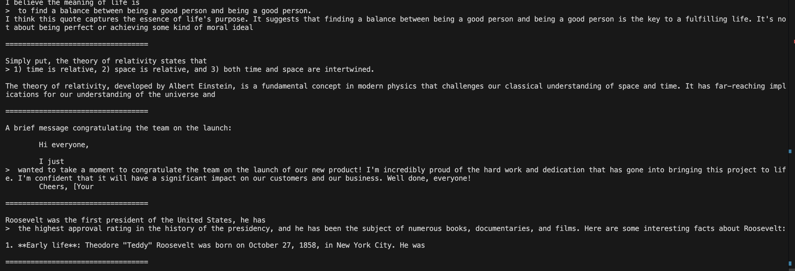
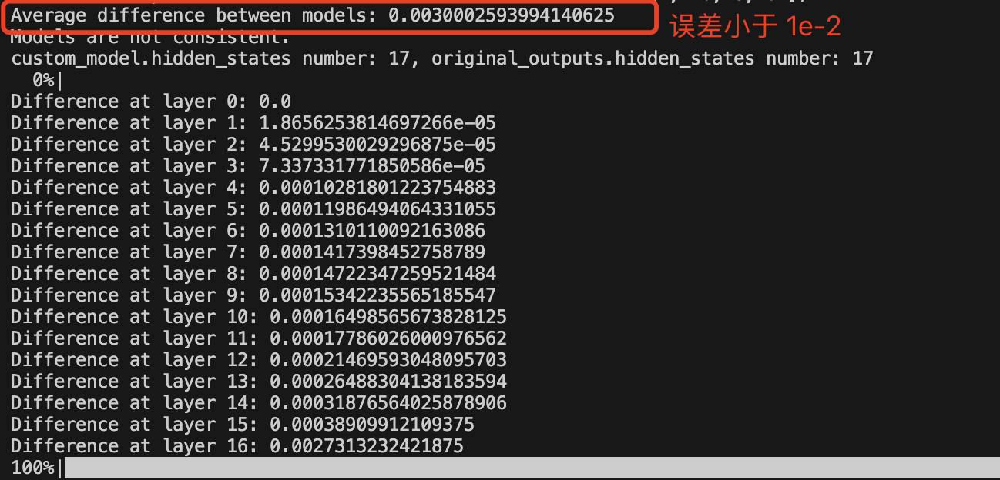
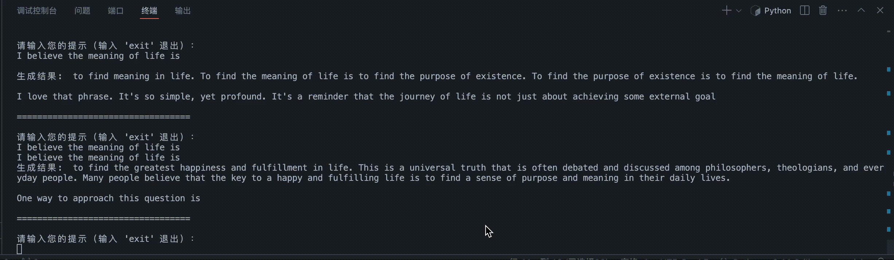
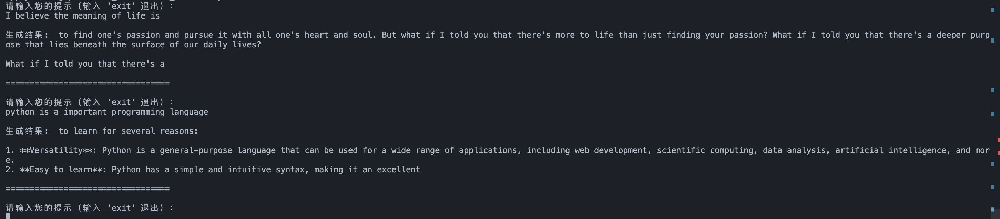

# lite_llama

The llama model inference lite framework by triton.

## 特性

- 相比 transformers, llama3 1B 和 3B 模型加速比最高达 3.4x倍。
- 支持最新的 `llama3`、`Qwen2.5`、`Llava1.5` 模型推理，支持 `top-p` 采样, 支持流式输出,。
- 支持 GQA、cuda graph 优化（有限制）。
- 支持 `flashattention1`、`flashattention2`、 `flashdecoding`。
- 支持 kv cache 的高效动态管理（`auto tokenattnetion`）。
- 支持算子融合，如：逐元素相乘 `*` 和 `silu` 的融合。
- 部分自定义算子如：`rmsnorm`、`rope`、`逐元素相乘` 等采用高效 `triton` 内核实现

## GPU Information

趋动云 GPU 开发环境，cuda 版本以及 torch、triton 版本：

```bash
# nvcc -V
nvcc: NVIDIA (R) Cuda compiler driver
Copyright (c) 2005-2023 NVIDIA Corporation
Built on Mon_Apr__3_17:16:06_PDT_2023
Cuda compilation tools, release 12.1, V12.1.105
Build cuda_12.1.r12.1/compiler.32688072_0
# Python 3.11.8 包版本:
# pip list | grep torch
torch                          2.1.2
triton                         2.1.0
triton-nightly                 3.0.0.post20240716052845
```

## 回答准确性验证

日常问答测试结果：



和 transformers 库回答结果对比、精度验证：



<!--  -->

llama3.2-1.5B-Instruct 模型流式输出结果测试：



`Qwen2.5-3B` 模型（社区版本）流式输出结果测试：


`Llava1.5-7b-hf` 模型流式输出结果测试:

<table style="width: 100%; table-layout: fixed;">
  <tr>
    <td align="center"></td>
    <td align="center"></td>
  </tr>
</table>

## 如何使用

推荐 cuda 版本 12.0 及以上。下载 [llama3.2-1B-Instruct 模型](https://pan.quark.cn/s/6eef1f2921e0)并放到指定 `cli.py` 文件的指定 `checkpoints_dir` 目录。

```bash
apt update
apt install imagemagick
conda create --name lite_llama python >= 3.10
conda activate lite_llama
git clone https://github.com/harleyszhang/lite_llama.git
cd lite_llama/
pip install -r requirement.txt
python cli.py # 已经下载好模型并放在指定目录的基础上运行
```

`cli.py` 程序运行成功后，终端显示界面如下所示，在终端中输入你的问题即可。



`cli——llava.py` 程序运行成功后，终端显示界面如下所示，在终端中输入你图片和提示词，然后回车即可。


## 性能优化

输入提示词：

```bash
prompts: List[str] = [
    # For these prompts, the expected answer is the natural continuation of the prompt
    "I believe the meaning of life is",
    "Simply put, the theory of relativity states that ",
    """A brief message congratulating the team on the launch:

    Hi everyone,
    
    I just """,
    # Few shot prompt (providing a few examples before asking model to complete more);
    "Roosevelt was the first president of the United States, he has",
]
```

1，针对 decode 阶段使用 cuda graph 优化后，单次 decode 阶段时间为 `8.2402` ms，使用之前为 `17.2241` ms，性能提升 2x 倍，这个结果跟 vllm 应用 cuda graph 后的性能提升倍数几乎一致。

```bash
INFO: After apply cuda graph, Decode inference time: 8.2402 ms
INFO: Before apply cuda graph, Decode inference time: 17.2241 ms
```

2，在前面的基础上，继续优化，使用 flashattention 替代原有的标准 attention。

> flashattention1 对训练模型帮助更大，在提示词很短时，其速度提升效果有限。推理时的 decode 阶段应该用 flash-decoding。

```bash
INFO: input tokens shape is  torch.Size([8, 115])
# 使用 flashattention 前
INFO:lite_llama.generate:Batch inference time: 3152.0476 ms
INFO:lite_llama.generate:Tokens per second: 97.71 tokens/s
# 使用 flashattention1 后
INFO:lite_llama.generate:Batch inference time: 2681.3823 ms
INFO:lite_llama.generate:Tokens per second: 114.87 tokens/s
```

3，继续优化, 将 `flashattention` 升级到 `flashattention2`, 减少一定计算量。

```bash
INFO:lite_llama.generate:Batch inference time: 2103.0737 ms
INFO:lite_llama.generate:Tokens per second: 146.45 tokens/s
```

4, 再次优化，decode 阶段的推理使用 `flashdecoding`，提升 decode 阶段的 attention 计算并行度，充分发挥 GPU 算力。

```bash
INFO:lite_llama.generate:Decode stage Batch inference time: 1641.4178 ms
INFO:lite_llama.generate:Decode stage tokens per second : 187.64 tokens/s
```

5, 继续再次优化，支持 kv cache 高效的动态管理（类似 tokenattention），解决了 kv cache 显存浪费和分配低效的问题。

```bash
INFO:lite_llama.generate:Decode stage Batch inference time: 1413.9111 ms
INFO:lite_llama.generate:Decode stage tokens per second : 217.84 tokens/s
```

6, 一个简单的优化, 使用 `GQA_KV_heads_index` 替代 `repeat_kv` 函数。

7, 一个常见且简单的优化, kv 线性层融合。

8, 重构并优化 `MHA` 模块：

- token_attention 支持直接传入 kv_cache 索引和序列实际长度 seq_len, 减少了 kv cache 在 `MHA` 模块中的 `concat` 和 `view` 操作，并实现了 `Nopad` token_attention。
- 将每次 decode 过程分配对应 kv cache 索引，改为在模型推理之前一次性分配连续的 `(max(promptes_len) + max_gen_len) * batch_size` 个 tokens 的 kv cache 空间。

## TODO

- 连续批处理。
- 支持 AWQ 和 SmoothQuant 量化。
- 重构代码以及修复 cuda graph 在 使用 AutoTokenAttention 优化后无法正常运行的问题。

## Acknowledgement

- [meta-llama/llama-models](https://github.com/meta-llama/llama-models/tree/main)
- [transformers](https://github.com/huggingface/transformers)
- [Liger-Kernel](https://github.com/linkedin/Liger-Kernel/tree/main)
- [kernl](https://github.com/ELS-RD/kernl/tree/main)
- [unsloth](https://github.com/unslothai/unsloth/tree/main)
- [openai-triton](https://triton-lang.org/main/getting-started/tutorials/)
- [lightllm](https://github.com/ModelTC/lightllm)
- [vllm](https://github.com/vllm-project/vllm)
