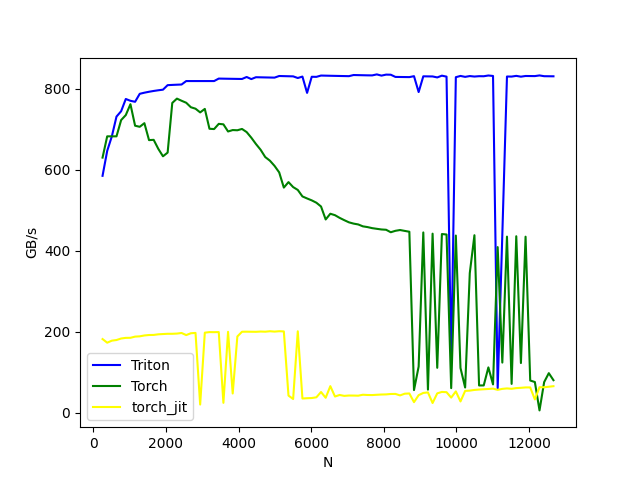
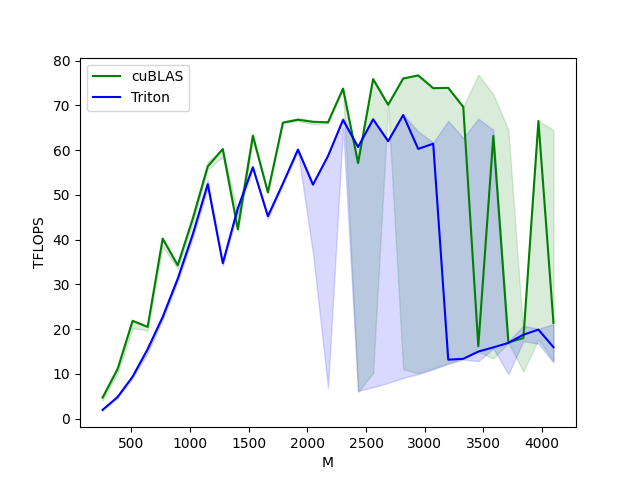
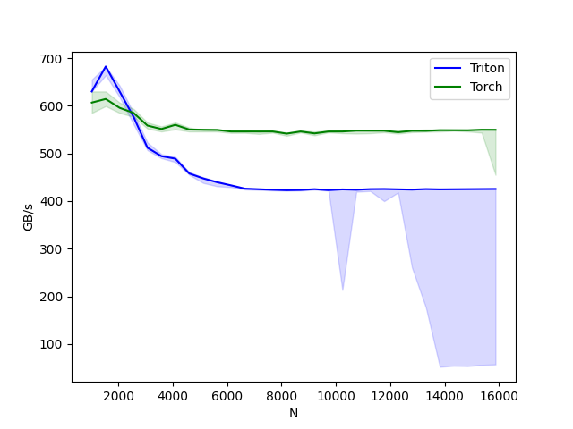

# Pytriton_llama

The llama model inference lite framework by tirton.

## GPU Information

趋动云 GPU 开发环境

```bash
/code# nvidia-smi
Using config file: /etc/orion/env/env.conf
+--------------------------------------------------------------------------------------------+
| ORION-SMI 1.0             Time: 2024-10-11 20:36:48            CUDA Version: N/A           |
+-----------------------------------------------+----------------------+---------------------+
| IP               vGPU Name       Persistence-M| Bus-Id        Disp.A | Volatile Uncorr. ECC|
| pGPU  vGPU       Physical GPU Name            |         Memory-Usage | GPU-Util  Compute M.|
|===============================================+======================+=====================|
| 0.0.0.0          Orion vGPU              Off  |   N/A            Off |                 N/A |
|  0     0         B1.gpu.small                 |      0MiB /  6062MiB |      0%     Default |
+--------------------------------------------------------------------------------------------+

+--------------------------------------------------------------------------------------------+
| Processes:                                                                     vGPU Memory |
| IP               pGPU  vGPU   PID      Type  Process name                         Usage    |
|============================================================================================|
|  No running processes found                                                                |
+--------------------------------------------------------------------------------------------+
```

cuda 版本：
```bash
# nvcc -V
nvcc: NVIDIA (R) Cuda compiler driver
Copyright (c) 2005-2023 NVIDIA Corporation
Built on Mon_Apr__3_17:16:06_PDT_2023
Cuda compilation tools, release 12.1, V12.1.105
Build cuda_12.1.r12.1/compiler.32688072_0
```

Python 3.11.8 包版本:

```bash
torch                          2.1.2
triton                         2.1.0
triton-nightly                 3.0.0.post20240716052845
```

## model archetecture parameters

my LLama parameters

```bash
norm_weight torch.Size([2048])
lm_head_weight torch.Size([2048, 128256])
tok_embeddings.weight torch.Size([128256, 2048])
layers.0.post_attention_weight torch.Size([2048])
layers.0.input_layernorm_weight torch.Size([2048])
layers.0.attention.q_proj_weight torch.Size([2048, 2048])
layers.0.attention.k_proj_weight torch.Size([2048, 2048])
layers.0.attention.v_proj_weight torch.Size([2048, 2048])
layers.0.attention.o_proj_weight torch.Size([2048, 2048])
layers.0.feed_forward.gate_proj_weight torch.Size([2048, 8192])
layers.0.feed_forward.up_proj_weight torch.Size([8192, 2048])
layers.0.feed_forward.down_proj_weight torch.Size([2048, 8192])
layers.1.post_attention_weight torch.Size([2048])
layers.1.input_layernorm_weight torch.Size([2048])
layers.1.attention.q_proj_weight torch.Size([2048, 2048])
layers.1.attention.k_proj_weight torch.Size([2048, 2048])
layers.1.attention.v_proj_weight torch.Size([2048, 2048])
layers.1.attention.o_proj_weight torch.Size([2048, 2048])
layers.1.feed_forward.gate_proj_weight torch.Size([2048, 8192])
layers.1.feed_forward.up_proj_weight torch.Size([8192, 2048])
layers.1.feed_forward.down_proj_weight torch.Size([2048, 8192])
layers.2.post_attention_weight torch.Size([2048])
layers.2.input_layernorm_weight torch.Size([2048])
layers.2.attention.q_proj_weight torch.Size([2048, 2048])
layers.2.attention.k_proj_weight torch.Size([2048, 2048])
layers.2.attention.v_proj_weight torch.Size([2048, 2048])
layers.2.attention.o_proj_weight torch.Size([2048, 2048])
layers.2.feed_forward.gate_proj_weight torch.Size([2048, 8192])
layers.2.feed_forward.up_proj_weight torch.Size([8192, 2048])
layers.2.feed_forward.down_proj_weight torch.Size([2048, 8192])
layers.3.post_attention_weight torch.Size([2048])
layers.3.input_layernorm_weight torch.Size([2048])
layers.3.attention.q_proj_weight torch.Size([2048, 2048])
layers.3.attention.k_proj_weight torch.Size([2048, 2048])
layers.3.attention.v_proj_weight torch.Size([2048, 2048])
layers.3.attention.o_proj_weight torch.Size([2048, 2048])
layers.3.feed_forward.gate_proj_weight torch.Size([2048, 8192])
layers.3.feed_forward.up_proj_weight torch.Size([8192, 2048])
layers.3.feed_forward.down_proj_weight torch.Size([2048, 8192])
layers.4.post_attention_weight torch.Size([2048])
layers.4.input_layernorm_weight torch.Size([2048])
layers.4.attention.q_proj_weight torch.Size([2048, 2048])
layers.4.attention.k_proj_weight torch.Size([2048, 2048])
layers.4.attention.v_proj_weight torch.Size([2048, 2048])
layers.4.attention.o_proj_weight torch.Size([2048, 2048])
layers.4.feed_forward.gate_proj_weight torch.Size([2048, 8192])
layers.4.feed_forward.up_proj_weight torch.Size([8192, 2048])
layers.4.feed_forward.down_proj_weight torch.Size([2048, 8192])
layers.5.post_attention_weight torch.Size([2048])
layers.5.input_layernorm_weight torch.Size([2048])
layers.5.attention.q_proj_weight torch.Size([2048, 2048])
layers.5.attention.k_proj_weight torch.Size([2048, 2048])
layers.5.attention.v_proj_weight torch.Size([2048, 2048])
layers.5.attention.o_proj_weight torch.Size([2048, 2048])
layers.5.feed_forward.gate_proj_weight torch.Size([2048, 8192])
layers.5.feed_forward.up_proj_weight torch.Size([8192, 2048])
layers.5.feed_forward.down_proj_weight torch.Size([2048, 8192])
layers.6.post_attention_weight torch.Size([2048])
layers.6.input_layernorm_weight torch.Size([2048])
layers.6.attention.q_proj_weight torch.Size([2048, 2048])
layers.6.attention.k_proj_weight torch.Size([2048, 2048])
layers.6.attention.v_proj_weight torch.Size([2048, 2048])
layers.6.attention.o_proj_weight torch.Size([2048, 2048])
layers.6.feed_forward.gate_proj_weight torch.Size([2048, 8192])
layers.6.feed_forward.up_proj_weight torch.Size([8192, 2048])
layers.6.feed_forward.down_proj_weight torch.Size([2048, 8192])
layers.7.post_attention_weight torch.Size([2048])
layers.7.input_layernorm_weight torch.Size([2048])
layers.7.attention.q_proj_weight torch.Size([2048, 2048])
layers.7.attention.k_proj_weight torch.Size([2048, 2048])
layers.7.attention.v_proj_weight torch.Size([2048, 2048])
layers.7.attention.o_proj_weight torch.Size([2048, 2048])
layers.7.feed_forward.gate_proj_weight torch.Size([2048, 8192])
layers.7.feed_forward.up_proj_weight torch.Size([8192, 2048])
layers.7.feed_forward.down_proj_weight torch.Size([2048, 8192])
layers.8.post_attention_weight torch.Size([2048])
layers.8.input_layernorm_weight torch.Size([2048])
layers.8.attention.q_proj_weight torch.Size([2048, 2048])
layers.8.attention.k_proj_weight torch.Size([2048, 2048])
layers.8.attention.v_proj_weight torch.Size([2048, 2048])
layers.8.attention.o_proj_weight torch.Size([2048, 2048])
layers.8.feed_forward.gate_proj_weight torch.Size([2048, 8192])
layers.8.feed_forward.up_proj_weight torch.Size([8192, 2048])
layers.8.feed_forward.down_proj_weight torch.Size([2048, 8192])
layers.9.post_attention_weight torch.Size([2048])
layers.9.input_layernorm_weight torch.Size([2048])
layers.9.attention.q_proj_weight torch.Size([2048, 2048])
layers.9.attention.k_proj_weight torch.Size([2048, 2048])
layers.9.attention.v_proj_weight torch.Size([2048, 2048])
layers.9.attention.o_proj_weight torch.Size([2048, 2048])
layers.9.feed_forward.gate_proj_weight torch.Size([2048, 8192])
layers.9.feed_forward.up_proj_weight torch.Size([8192, 2048])
layers.9.feed_forward.down_proj_weight torch.Size([2048, 8192])
layers.10.post_attention_weight torch.Size([2048])
layers.10.input_layernorm_weight torch.Size([2048])
layers.10.attention.q_proj_weight torch.Size([2048, 2048])
layers.10.attention.k_proj_weight torch.Size([2048, 2048])
layers.10.attention.v_proj_weight torch.Size([2048, 2048])
layers.10.attention.o_proj_weight torch.Size([2048, 2048])
layers.10.feed_forward.gate_proj_weight torch.Size([2048, 8192])
layers.10.feed_forward.up_proj_weight torch.Size([8192, 2048])
layers.10.feed_forward.down_proj_weight torch.Size([2048, 8192])
layers.11.post_attention_weight torch.Size([2048])
layers.11.input_layernorm_weight torch.Size([2048])
layers.11.attention.q_proj_weight torch.Size([2048, 2048])
layers.11.attention.k_proj_weight torch.Size([2048, 2048])
layers.11.attention.v_proj_weight torch.Size([2048, 2048])
layers.11.attention.o_proj_weight torch.Size([2048, 2048])
layers.11.feed_forward.gate_proj_weight torch.Size([2048, 8192])
layers.11.feed_forward.up_proj_weight torch.Size([8192, 2048])
layers.11.feed_forward.down_proj_weight torch.Size([2048, 8192])
layers.12.post_attention_weight torch.Size([2048])
layers.12.input_layernorm_weight torch.Size([2048])
layers.12.attention.q_proj_weight torch.Size([2048, 2048])
layers.12.attention.k_proj_weight torch.Size([2048, 2048])
layers.12.attention.v_proj_weight torch.Size([2048, 2048])
layers.12.attention.o_proj_weight torch.Size([2048, 2048])
layers.12.feed_forward.gate_proj_weight torch.Size([2048, 8192])
layers.12.feed_forward.up_proj_weight torch.Size([8192, 2048])
layers.12.feed_forward.down_proj_weight torch.Size([2048, 8192])
layers.13.post_attention_weight torch.Size([2048])
layers.13.input_layernorm_weight torch.Size([2048])
layers.13.attention.q_proj_weight torch.Size([2048, 2048])
layers.13.attention.k_proj_weight torch.Size([2048, 2048])
layers.13.attention.v_proj_weight torch.Size([2048, 2048])
layers.13.attention.o_proj_weight torch.Size([2048, 2048])
layers.13.feed_forward.gate_proj_weight torch.Size([2048, 8192])
layers.13.feed_forward.up_proj_weight torch.Size([8192, 2048])
layers.13.feed_forward.down_proj_weight torch.Size([2048, 8192])
layers.14.post_attention_weight torch.Size([2048])
layers.14.input_layernorm_weight torch.Size([2048])
layers.14.attention.q_proj_weight torch.Size([2048, 2048])
layers.14.attention.k_proj_weight torch.Size([2048, 2048])
layers.14.attention.v_proj_weight torch.Size([2048, 2048])
layers.14.attention.o_proj_weight torch.Size([2048, 2048])
layers.14.feed_forward.gate_proj_weight torch.Size([2048, 8192])
layers.14.feed_forward.up_proj_weight torch.Size([8192, 2048])
layers.14.feed_forward.down_proj_weight torch.Size([2048, 8192])
layers.15.post_attention_weight torch.Size([2048])
layers.15.input_layernorm_weight torch.Size([2048])
layers.15.attention.q_proj_weight torch.Size([2048, 2048])
layers.15.attention.k_proj_weight torch.Size([2048, 2048])
layers.15.attention.v_proj_weight torch.Size([2048, 2048])
layers.15.attention.o_proj_weight torch.Size([2048, 2048])
layers.15.feed_forward.gate_proj_weight torch.Size([2048, 8192])
layers.15.feed_forward.up_proj_weight torch.Size([8192, 2048])
layers.15.feed_forward.down_proj_weight torch.Size([2048, 8192])
```

transformers LlamaForCausalLM parameters

```bash
model.embed_tokens.weight torch.Size([128256, 2048])
model.layers.0.self_attn.q_proj.weight torch.Size([2048, 2048])
model.layers.0.self_attn.k_proj.weight torch.Size([512, 2048])
model.layers.0.self_attn.v_proj.weight torch.Size([512, 2048])
model.layers.0.self_attn.o_proj.weight torch.Size([2048, 2048])
model.layers.0.mlp.gate_proj.weight torch.Size([8192, 2048])
model.layers.0.mlp.up_proj.weight torch.Size([8192, 2048])
model.layers.0.mlp.down_proj.weight torch.Size([2048, 8192])
model.layers.0.input_layernorm.weight torch.Size([2048])
model.layers.0.post_attention_layernorm.weight torch.Size([2048])
model.layers.1.self_attn.q_proj.weight torch.Size([2048, 2048])
model.layers.1.self_attn.k_proj.weight torch.Size([512, 2048])
model.layers.1.self_attn.v_proj.weight torch.Size([512, 2048])
model.layers.1.self_attn.o_proj.weight torch.Size([2048, 2048])
model.layers.1.mlp.gate_proj.weight torch.Size([8192, 2048])
model.layers.1.mlp.up_proj.weight torch.Size([8192, 2048])
model.layers.1.mlp.down_proj.weight torch.Size([2048, 8192])
model.layers.1.input_layernorm.weight torch.Size([2048])
model.layers.1.post_attention_layernorm.weight torch.Size([2048])
model.layers.2.self_attn.q_proj.weight torch.Size([2048, 2048])
model.layers.2.self_attn.k_proj.weight torch.Size([512, 2048])
model.layers.2.self_attn.v_proj.weight torch.Size([512, 2048])
model.layers.2.self_attn.o_proj.weight torch.Size([2048, 2048])
model.layers.2.mlp.gate_proj.weight torch.Size([8192, 2048])
model.layers.2.mlp.up_proj.weight torch.Size([8192, 2048])
model.layers.2.mlp.down_proj.weight torch.Size([2048, 8192])
model.layers.2.input_layernorm.weight torch.Size([2048])
model.layers.2.post_attention_layernorm.weight torch.Size([2048])
model.layers.3.self_attn.q_proj.weight torch.Size([2048, 2048])
model.layers.3.self_attn.k_proj.weight torch.Size([512, 2048])
model.layers.3.self_attn.v_proj.weight torch.Size([512, 2048])
model.layers.3.self_attn.o_proj.weight torch.Size([2048, 2048])
model.layers.3.mlp.gate_proj.weight torch.Size([8192, 2048])
model.layers.3.mlp.up_proj.weight torch.Size([8192, 2048])
model.layers.3.mlp.down_proj.weight torch.Size([2048, 8192])
model.layers.3.input_layernorm.weight torch.Size([2048])
model.layers.3.post_attention_layernorm.weight torch.Size([2048])
model.layers.4.self_attn.q_proj.weight torch.Size([2048, 2048])
model.layers.4.self_attn.k_proj.weight torch.Size([512, 2048])
model.layers.4.self_attn.v_proj.weight torch.Size([512, 2048])
model.layers.4.self_attn.o_proj.weight torch.Size([2048, 2048])
model.layers.4.mlp.gate_proj.weight torch.Size([8192, 2048])
model.layers.4.mlp.up_proj.weight torch.Size([8192, 2048])
model.layers.4.mlp.down_proj.weight torch.Size([2048, 8192])
model.layers.4.input_layernorm.weight torch.Size([2048])
model.layers.4.post_attention_layernorm.weight torch.Size([2048])
model.layers.5.self_attn.q_proj.weight torch.Size([2048, 2048])
model.layers.5.self_attn.k_proj.weight torch.Size([512, 2048])
model.layers.5.self_attn.v_proj.weight torch.Size([512, 2048])
model.layers.5.self_attn.o_proj.weight torch.Size([2048, 2048])
model.layers.5.mlp.gate_proj.weight torch.Size([8192, 2048])
model.layers.5.mlp.up_proj.weight torch.Size([8192, 2048])
model.layers.5.mlp.down_proj.weight torch.Size([2048, 8192])
model.layers.5.input_layernorm.weight torch.Size([2048])
model.layers.5.post_attention_layernorm.weight torch.Size([2048])
model.layers.6.self_attn.q_proj.weight torch.Size([2048, 2048])
model.layers.6.self_attn.k_proj.weight torch.Size([512, 2048])
model.layers.6.self_attn.v_proj.weight torch.Size([512, 2048])
model.layers.6.self_attn.o_proj.weight torch.Size([2048, 2048])
model.layers.6.mlp.gate_proj.weight torch.Size([8192, 2048])
model.layers.6.mlp.up_proj.weight torch.Size([8192, 2048])
model.layers.6.mlp.down_proj.weight torch.Size([2048, 8192])
model.layers.6.input_layernorm.weight torch.Size([2048])
model.layers.6.post_attention_layernorm.weight torch.Size([2048])
model.layers.7.self_attn.q_proj.weight torch.Size([2048, 2048])
model.layers.7.self_attn.k_proj.weight torch.Size([512, 2048])
model.layers.7.self_attn.v_proj.weight torch.Size([512, 2048])
model.layers.7.self_attn.o_proj.weight torch.Size([2048, 2048])
model.layers.7.mlp.gate_proj.weight torch.Size([8192, 2048])
model.layers.7.mlp.up_proj.weight torch.Size([8192, 2048])
model.layers.7.mlp.down_proj.weight torch.Size([2048, 8192])
model.layers.7.input_layernorm.weight torch.Size([2048])
model.layers.7.post_attention_layernorm.weight torch.Size([2048])
model.layers.8.self_attn.q_proj.weight torch.Size([2048, 2048])
model.layers.8.self_attn.k_proj.weight torch.Size([512, 2048])
model.layers.8.self_attn.v_proj.weight torch.Size([512, 2048])
model.layers.8.self_attn.o_proj.weight torch.Size([2048, 2048])
model.layers.8.mlp.gate_proj.weight torch.Size([8192, 2048])
model.layers.8.mlp.up_proj.weight torch.Size([8192, 2048])
model.layers.8.mlp.down_proj.weight torch.Size([2048, 8192])
model.layers.8.input_layernorm.weight torch.Size([2048])
model.layers.8.post_attention_layernorm.weight torch.Size([2048])
model.layers.9.self_attn.q_proj.weight torch.Size([2048, 2048])
model.layers.9.self_attn.k_proj.weight torch.Size([512, 2048])
model.layers.9.self_attn.v_proj.weight torch.Size([512, 2048])
model.layers.9.self_attn.o_proj.weight torch.Size([2048, 2048])
model.layers.9.mlp.gate_proj.weight torch.Size([8192, 2048])
model.layers.9.mlp.up_proj.weight torch.Size([8192, 2048])
model.layers.9.mlp.down_proj.weight torch.Size([2048, 8192])
model.layers.9.input_layernorm.weight torch.Size([2048])
model.layers.9.post_attention_layernorm.weight torch.Size([2048])
model.layers.10.self_attn.q_proj.weight torch.Size([2048, 2048])
model.layers.10.self_attn.k_proj.weight torch.Size([512, 2048])
model.layers.10.self_attn.v_proj.weight torch.Size([512, 2048])
model.layers.10.self_attn.o_proj.weight torch.Size([2048, 2048])
model.layers.10.mlp.gate_proj.weight torch.Size([8192, 2048])
model.layers.10.mlp.up_proj.weight torch.Size([8192, 2048])
model.layers.10.mlp.down_proj.weight torch.Size([2048, 8192])
model.layers.10.input_layernorm.weight torch.Size([2048])
model.layers.10.post_attention_layernorm.weight torch.Size([2048])
model.layers.11.self_attn.q_proj.weight torch.Size([2048, 2048])
model.layers.11.self_attn.k_proj.weight torch.Size([512, 2048])
model.layers.11.self_attn.v_proj.weight torch.Size([512, 2048])
model.layers.11.self_attn.o_proj.weight torch.Size([2048, 2048])
model.layers.11.mlp.gate_proj.weight torch.Size([8192, 2048])
model.layers.11.mlp.up_proj.weight torch.Size([8192, 2048])
model.layers.11.mlp.down_proj.weight torch.Size([2048, 8192])
model.layers.11.input_layernorm.weight torch.Size([2048])
model.layers.11.post_attention_layernorm.weight torch.Size([2048])
model.layers.12.self_attn.q_proj.weight torch.Size([2048, 2048])
model.layers.12.self_attn.k_proj.weight torch.Size([512, 2048])
model.layers.12.self_attn.v_proj.weight torch.Size([512, 2048])
model.layers.12.self_attn.o_proj.weight torch.Size([2048, 2048])
model.layers.12.mlp.gate_proj.weight torch.Size([8192, 2048])
model.layers.12.mlp.up_proj.weight torch.Size([8192, 2048])
model.layers.12.mlp.down_proj.weight torch.Size([2048, 8192])
model.layers.12.input_layernorm.weight torch.Size([2048])
model.layers.12.post_attention_layernorm.weight torch.Size([2048])
model.layers.13.self_attn.q_proj.weight torch.Size([2048, 2048])
model.layers.13.self_attn.k_proj.weight torch.Size([512, 2048])
model.layers.13.self_attn.v_proj.weight torch.Size([512, 2048])
model.layers.13.self_attn.o_proj.weight torch.Size([2048, 2048])
model.layers.13.mlp.gate_proj.weight torch.Size([8192, 2048])
model.layers.13.mlp.up_proj.weight torch.Size([8192, 2048])
model.layers.13.mlp.down_proj.weight torch.Size([2048, 8192])
model.layers.13.input_layernorm.weight torch.Size([2048])
model.layers.13.post_attention_layernorm.weight torch.Size([2048])
model.layers.14.self_attn.q_proj.weight torch.Size([2048, 2048])
model.layers.14.self_attn.k_proj.weight torch.Size([512, 2048])
model.layers.14.self_attn.v_proj.weight torch.Size([512, 2048])
model.layers.14.self_attn.o_proj.weight torch.Size([2048, 2048])
model.layers.14.mlp.gate_proj.weight torch.Size([8192, 2048])
model.layers.14.mlp.up_proj.weight torch.Size([8192, 2048])
model.layers.14.mlp.down_proj.weight torch.Size([2048, 8192])
model.layers.14.input_layernorm.weight torch.Size([2048])
model.layers.14.post_attention_layernorm.weight torch.Size([2048])
model.layers.15.self_attn.q_proj.weight torch.Size([2048, 2048])
model.layers.15.self_attn.k_proj.weight torch.Size([512, 2048])
model.layers.15.self_attn.v_proj.weight torch.Size([512, 2048])
model.layers.15.self_attn.o_proj.weight torch.Size([2048, 2048])
model.layers.15.mlp.gate_proj.weight torch.Size([8192, 2048])
model.layers.15.mlp.up_proj.weight torch.Size([8192, 2048])
model.layers.15.mlp.down_proj.weight torch.Size([2048, 8192])
model.layers.15.input_layernorm.weight torch.Size([2048])
model.layers.15.post_attention_layernorm.weight torch.Size([2048])
model.norm.weight torch.Size([2048])
```

## kernels unit test

```bash
=========================================================================================== test session starts ============================================================================================
platform linux -- Python 3.11.8, pytest-8.3.3, pluggy-1.5.0 -- /root/miniconda3/bin/python
cachedir: .pytest_cache
rootdir: /gemini/code/pytriton_llama
plugins: anyio-4.3.0
collected 41 items                                                                                                                                                                                         

unit_test.py::test_fused_ffn[128-128-64] PASSED                                                                                                                                                      [  2%]
unit_test.py::test_rmsnorm[32-128] PASSED                                                                                                                                                            [  4%]
unit_test.py::test_rmsnorm[32-32] PASSED                                                                                                                                                             [  7%]
unit_test.py::test_rmsnorm[128-128] PASSED                                                                                                                                                           [  9%]
unit_test.py::test_rmsnorm[128-32] PASSED                                                                                                                                                            [ 12%]
unit_test.py::test_rmsnorm[64-128] PASSED                                                                                                                                                            [ 14%]
unit_test.py::test_rmsnorm[64-32] PASSED                                                                                                                                                             [ 17%]
unit_test.py::test_layernorm[32-128] PASSED                                                                                                                                                          [ 19%]
unit_test.py::test_layernorm[32-32] PASSED                                                                                                                                                           [ 21%]
unit_test.py::test_layernorm[32-64] PASSED                                                                                                                                                           [ 24%]
unit_test.py::test_layernorm[128-128] PASSED                                                                                                                                                         [ 26%]
unit_test.py::test_layernorm[128-32] PASSED                                                                                                                                                          [ 29%]
unit_test.py::test_layernorm[128-64] PASSED                                                                                                                                                          [ 31%]
unit_test.py::test_layernorm[64-128] PASSED                                                                                                                                                          [ 34%]
unit_test.py::test_layernorm[64-32] PASSED                                                                                                                                                           [ 36%]
unit_test.py::test_layernorm[64-64] PASSED                                                                                                                                                           [ 39%]
unit_test.py::test_softmax[32-128] PASSED                                                                                                                                                            [ 41%]
unit_test.py::test_softmax[32-32] PASSED                                                                                                                                                             [ 43%]
unit_test.py::test_softmax[32-64] PASSED                                                                                                                                                             [ 46%]
unit_test.py::test_softmax[128-128] PASSED                                                                                                                                                           [ 48%]
unit_test.py::test_softmax[128-32] PASSED                                                                                                                                                            [ 51%]
unit_test.py::test_softmax[128-64] PASSED                                                                                                                                                            [ 53%]
unit_test.py::test_softmax[64-128] PASSED                                                                                                                                                            [ 56%]
unit_test.py::test_softmax[64-32] PASSED                                                                                                                                                             [ 58%]
unit_test.py::test_softmax[64-64] PASSED                                                                                                                                                             [ 60%]
unit_test.py::test_flash_attention_v1[32-128-4-8] PASSED                                                                                                                                             [ 63%]
unit_test.py::test_flash_attention_v1[32-128-8-16] PASSED                                                                                                                                            [ 65%]
unit_test.py::test_flash_attention_v1[32-128-24-32] PASSED                                                                                                                                           [ 68%]
unit_test.py::test_flash_attention_v1[32-128-64-20] PASSED                                                                                                                                           [ 70%]
unit_test.py::test_flash_attention_v1[32-256-4-8] PASSED                                                                                                                                             [ 73%]
unit_test.py::test_flash_attention_v1[32-256-8-16] PASSED                                                                                                                                            [ 75%]
unit_test.py::test_flash_attention_v1[32-256-24-32] PASSED                                                                                                                                           [ 78%]
unit_test.py::test_flash_attention_v1[32-256-64-20] PASSED                                                                                                                                           [ 80%]
unit_test.py::test_flash_attention_v1[64-128-4-8] PASSED                                                                                                                                             [ 82%]
unit_test.py::test_flash_attention_v1[64-128-8-16] PASSED                                                                                                                                            [ 85%]
unit_test.py::test_flash_attention_v1[64-128-24-32] PASSED                                                                                                                                           [ 87%]
unit_test.py::test_flash_attention_v1[64-128-64-20] PASSED                                                                                                                                           [ 90%]
unit_test.py::test_flash_attention_v1[64-256-4-8] PASSED                                                                                                                                             [ 92%]
unit_test.py::test_flash_attention_v1[64-256-8-16] PASSED                                                                                                                                            [ 95%]
unit_test.py::test_flash_attention_v1[64-256-24-32] PASSED                                                                                                                                           [ 97%]
unit_test.py::test_flash_attention_v1[64-256-64-20] PASSED                                                                                                                                           [100%]

============================================================================================ 41 passed in 7.32s ============================================================================================
```

## kernels benchmark test

### softmax

softmax benchmark test result:



### linear

linear(matmul) benchmark test result:



### rmsnorm

rmsnorm benchmark test result:


### layernorm

layernorm benchmark test result:



### flashattention

flashattention benchmark test result:


## 回答准确性测试

transformers 回答

```bash
# 提示词
I believe the meaning of life is, 
# 模型回答
and has always been, to love. The more you give away your heart, the less you have left for yourself.
This quote from Jack Kerouac captures a profound truth about human existence: that our true purpose in life lies not just in achieving success or accumulating wealth but in cultivating genuine connections with others.

```
lite_llama 回答

```bash
# 提示词
I believe the meaning of life is, 

```
## Some triton kernels repositories

- https://github.com/ELS-RD/kernl/tree/main
- https://github.com/unslothai/unsloth/tree/main
https://triton-lang.org/main/getting-started/tutorials/